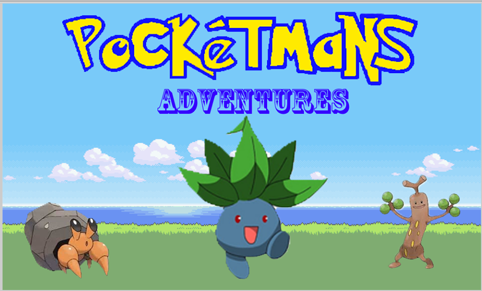

# Pocketmans
A Pokemon knockoff for a computer science project completed in a group of 3.

Uses Ready to Program Java HSA console.
___
The program is a game in which the player can engage in battles and follow through an interesting storyline.

The player can catch other "pocketmans" while becoming stronger with each consecutive battle.

The battle is done via a turn-based system where the player and the ai takes turns for attacks.

The program uses a combination of both HSA and GUI. HSA is generally used for animation and graphics.

GUI is used for the battles as the player clicks on buttons to perform attacks.
___
Instructions are with the opening background story

Repeat: wasd for movements w-up s-down a-left d-right 

'e' is used to interact with things which includes: pocketballs, pocketmans, and signs.
___

